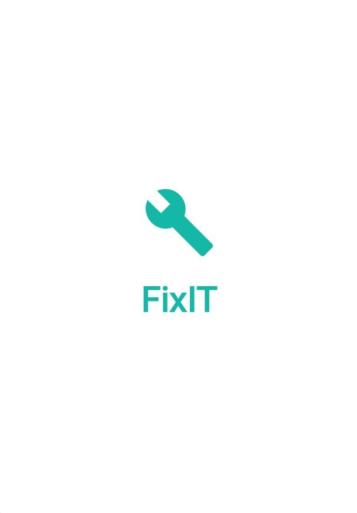

# FixIT – Smart Local Service Marketplace

<p align="center">
	
</p>

  
**Last Updated:** May 1, 2026

---

## 🚀 Overview

FixIT is a smart, full-stack local service marketplace platform. It connects customers with local service providers, featuring:

- **Flutter Frontend:** Modern, responsive, and feature-rich mobile/web app
- **Django Backend:** Secure REST API with JWT authentication

---

## 🎯 Key Features

- **Authentication System:** JWT-based login/register, role-based navigation
- **Service Marketplace:** Browse, search, filter, and request services
- **Smart Job Requests:** Post requests for unavailable services
- **Real-Time Notifications:** Service availability alerts
- **Google Maps Integration:** Visual location pins and navigation
- **Enhanced Search:** Suggestions and YouTube-like experience
- **Booking System:** Complete booking lifecycle
- **Rating System:** Rate and review workers
- **Worker Dashboard:** Stats and quick actions
- **Profile Management:** User profile and settings
- **Theme System:** Light/dark mode
- **Responsive Design:** All screen sizes
- **Robust Error Handling & Loading States**

---

## 🏗️ Architecture

```
FixIT/
├── backend/   # Django REST API
│   ├── manage.py
│   ├── config/
│   └── fixitapp/
├── frontend/  # Flutter app
│   ├── lib/
│   ├── pubspec.yaml
│   └── ...
└── README.md
```

---

## ⚡ Quick Start

### 1. Backend (Django)

```bash
cd backend
python -m venv venv
venv\Scripts\activate  # On Windows
pip install -r requirements.txt
python manage.py migrate
python manage.py runserver
```

### 2. Frontend (Flutter)

```bash
cd frontend
flutter pub get
flutter run
```

---

## 🧪 Testing

- **Backend:**
	- Run: `python manage.py test`
- **Frontend:**
	- Run: `flutter test`

---

## 🤝 Contributing

1. Fork the repo and create your branch
2. Make your changes and add tests
3. Submit a pull request

---

## 📄 Documentation

- **Quick Start:** See the Quick Start section above for setup instructions.
- **API Reference:** All REST endpoints are implemented in the Django backend (`backend/fixitapp/urls.py`, `views.py`).
- **Frontend Structure:**
	- Main app: `frontend/lib/`
	- UI: `frontend/lib/screens/`, `frontend/lib/widgets/`
	- Services/API: `frontend/lib/services/`
- **Backend Structure:**
	- Django app: `backend/fixitapp/`
	- Configuration: `backend/config/`
	- Key files: `models.py`, `views.py`, `serializers.py`, `urls.py`
- **Testing:**
	- Backend: `python manage.py test`
	- Frontend: `flutter test`
	- API sample: `test_api.http`

---


## 🏆 Status

- **Frontend:**
	- 95% complete, all critical features implemented
	- Codebase: `frontend/lib/` (main app), `frontend/assets/` (images/icons), `frontend/web/` (web support)
	- Key files: `main.dart`, `app.dart`, `screens/`, `widgets/`, `services/`
- **Backend:**
	- 95% complete, all critical endpoints implemented
	- Codebase: `backend/fixitapp/` (Django app), `backend/config/` (settings/routing)
	- Key files: `views.py`, `serializers.py`, `urls.py`, `models.py`
- **Integration:**
	- 100% complete, real API calls, no mock data
	- API endpoints consumed in `frontend/lib/services/` and tested via `test_api.http`
- **Production Ready:** Yes – passes all documented tests, no critical bugs

---


## ❓ FAQ

**Q: How do I report a bug or request a feature?**  
A: Please open an issue or pull request in the repository.

**Q: Can I use FixIT for my own service marketplace?**  
A: Yes! The code is modular and can be adapted for similar platforms.

**Q: What platforms are supported?**  
A: Web, Android, iOS, Windows, MacOS, and Linux (via Flutter).

**Q: How do I reset the backend database?**  
A: Run `python manage.py flush` in the backend directory (this will delete all data).

---


## 🙏 Credits

- **Frontend:** Flutter/Dart (`frontend/`)
- **Backend:** Django/Python (`backend/`)

